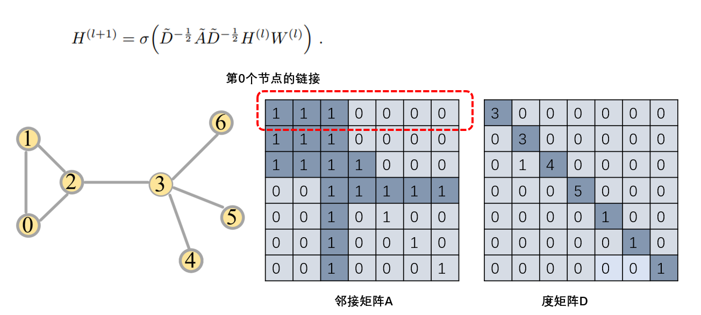
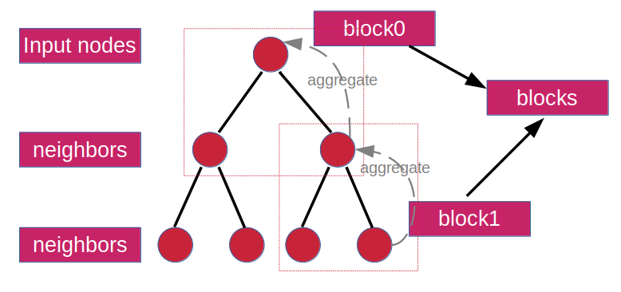
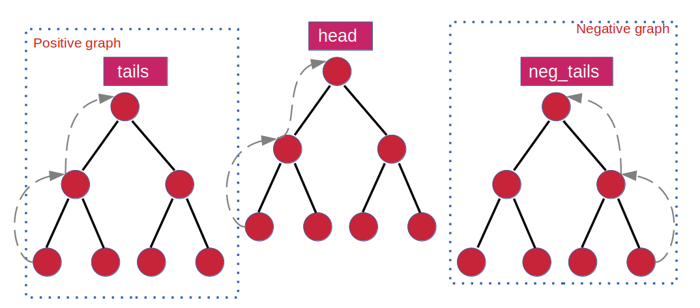

### 图模型实践
图模型项目实践、论文复现、持续更新、欢迎star、交流学习。

#### 1. 环境准备
based on dgl and pytorch mainly
>pip install -r requirements.txt

#### 2. 数据
>download dataset，put it to ./data/\

uploaded dataset blog already

#### 3. 图模型代码详解：
Notes of model written here:   
1. [游走图模型--同构图DeepWalk解析](https://zhuanlan.zhihu.com/p/397710211)
2. [游走图模型-聊聊Node2Vec](https://zhuanlan.zhihu.com/p/400849086)
3. [图卷积：从GCN到GAT、GraphSAGE](https://zhuanlan.zhihu.com/p/404826711)
4. [怎么搭一个GCN？只需这四步](https://zhuanlan.zhihu.com/p/422380707)
5. [怎么搭好一个GraphSAGE？按这三步走](https://zhuanlan.zhihu.com/p/429147607)
6. [Link-Prediction：搭一个无监督的GraphSAGE](https://zhuanlan.zhihu.com/p/435766657)
#### How to run
##### DeepWalk
①. How to run deepwalk model for graph embedding？
>cd deepwalk
>python main.py

②. node classification task
>python node_classification.py

#### Node2Vec
①. How to run Node2Vec model 
>cd node2vec
>python main.py

②. node classification task(should chang the checkpoint of node2vec in node_classification.py)
>python node_classification.py

##### GCN

①. How to run GCN model 
>python train.py

Cora dataset node classification(cora dataset will be download in ~/.dgl/ automatically).  
Test accuracy ~0.806 (0.793-0.819) ([paper](https://arxiv.org/abs/1609.02907): 0.815).

##### GraphSAGE

###### Node Classification

①. How to run GraphSAGE model
>cd graphsage/node_classification
>python train.py

Cora dataset node classification(cora dataset will be download in ~/.dgl/ automatically).  
Test accuracy ~0.781(0.762-0.801)  ([paper](https://arxiv.org/abs/1609.02907): 0.815).

###### Link Prediction

①. How to run GraphSAGE model 
>cd graphsage/link_prediction
>python train.py

Test F1: 0.630 (0.612~0.648) (cora数据集)